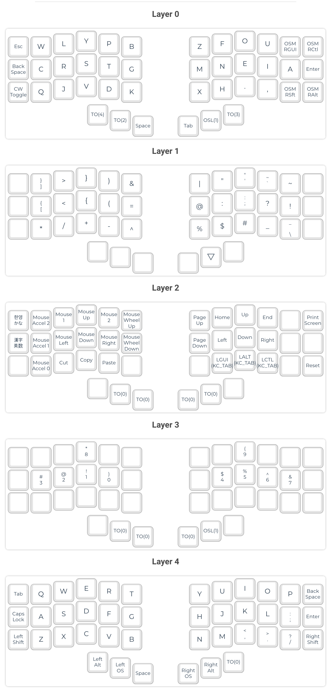

# code-pillow

alternative layout with focus on coding comfort &amp; ergonomics

## base layer

using canary layout for better comfort when typing text. (much more comfortable than qwerty)

https://github.com/Apsu/Canary

## symbol layer

coding requires using symbols quite often. but most of the time we need only one symbol.

OSL (1) means that we switch to symbol layer for one keypress only.

this key is very easy accessible (under the thumb).

symbols are optimized for node js + typescript but can be swapped around if different language is used more often. no more stretching your fingers (stay mostly in home row)

## number layer

separate layer for numbers. number order is optimized for programming (0 and 1 are most used) but also arranged in logical order.

## nav layer (navigation)

layer for controlling navigation (mouse and keyboard).
dont need to ever move your hands from the home row position.
keys are arranged in logical order.

## tab and space placement

tab and space are used quite often in programming. tab especially is used even more this days with rise of ai autocomplete. those are under thumbs for easy access.

## enter

close enough to easily use it, also similar position to most keyboards so easier to remember.

## backspace

we are humans, we make mistakes. good to have in nice place (left pinky)

## one shot modifiers (OSM)

shift, alt, ctrl, cmd - those are often used with combination with one other key. press once (dont hold) for more comfort.

## qwerty layout

emergency layout in case you want to switch to something resembling the default layout. all keys are in positions that are as close as possible to traditional layout.

