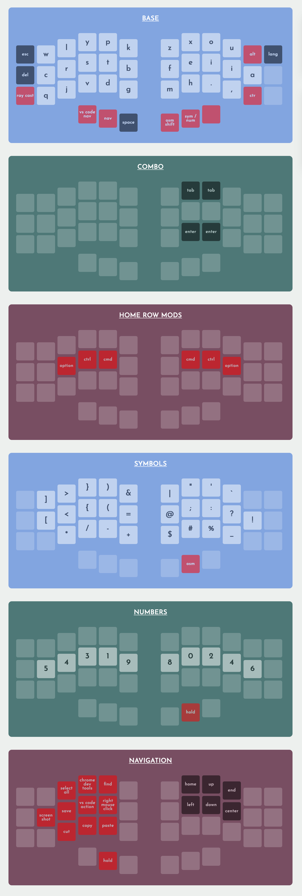

# code-pillow

alternative layout with focus on coding comfort &amp; ergonomics

(generated with butterkeys at https://jaroslaw-weber.github.io/butterkeys/ )

## base layer

using canary layout for better comfort when typing text. (much more comfortable than qwerty)

https://github.com/Apsu/Canary

## symbol layer

coding requires using symbols quite often. but most of the time we need only one symbol.

press thumb key to switch to symbol layer for one keypress only.

this key is very easy accessible (under the thumb).

symbols are optimized for node js + typescript but can be swapped around if different language is used more often. no more stretching your fingers (stay mostly in home row)

## number layer

hold thumb key to type numbers.

separate layer for numbers. number order is optimized for programming (0 and 1 are most used) but also arranged in logical order (even numbers on the right, odd numbers on the left).

## nav layer (navigation)

layer for controlling navigation.
also a lot of shortcuts that are useful while using mouse with right hand

## space

easy to access under the thumb

## magic shift

press once - will only apply to next key press (easy capitalization)
hold down - write in uppercase

## enter and tab

easy to reach combos on base layer

## backspace

we are humans, we make mistakes. good to have in nice place (left pinky)

## home row mods (without shift)

it's so much more comfortable! remember to use 'mod interrupt' to make typing more smooth.
shift can be tricky so not in home row.

## vscode layer (ongoing experiment)

hold down thumb to activate vscode focused layer (start, restart, etc)